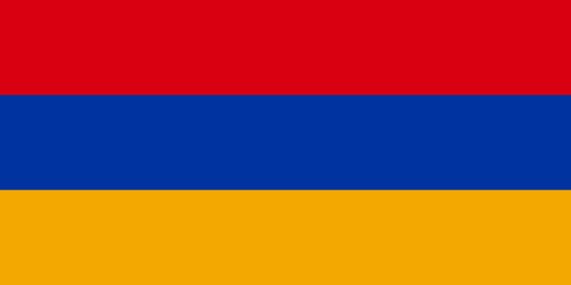
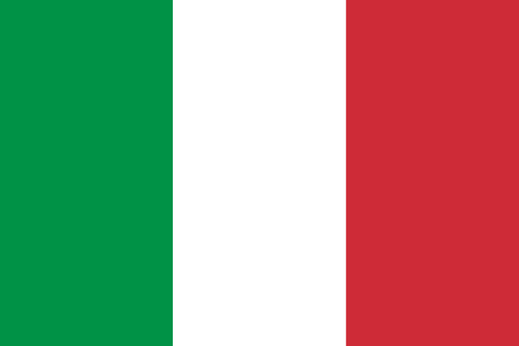
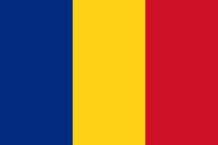
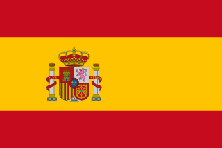
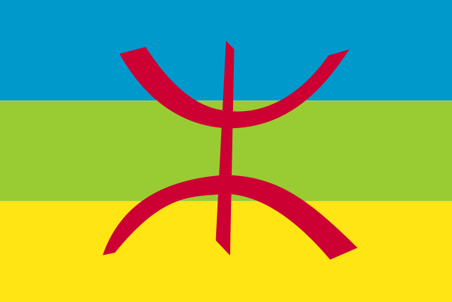

# AnySoftKeyboard Add-On Packs
`master` latest build: [](https://circleci.com/gh/AnySoftKeyboard/LanguagePack/tree/master)<br/>
<br/>
&nbsp;&nbsp;&nbsp;&nbsp;[](https://gitter.im/AnySoftKeyboard)

This repo holds the Add-On API module and all the official language packs and themes for AnySoftKeyboard (in a mono-repo style).
Each language is a set of two modules, `pack` and `apk`. `pack` is an Android library that holds all the information about the language pack (keyboards, dictionaries, receivers, etc.),
while `apk` bundles that into an installable (and publishable) APK.

**NOTE**: this repo is in transition to mono-repo style. Some language-packs are in _master_ while others are still in the old structure where each language-pack is a branch.

## How to create a Language-Pack

Let's say you want to create a language-pack for Klingon. We'll call the pack `klingon`, and its locale is `kl`.
1. Easiest way to start, is to duplicate one of the other packs: `cp -R english klingon`.
1. Add the new modules to Gradle. Edit `settings.gradle`, add the line:
```
include ":languages:klingon:pack", ":languages:klingon:apk"
```
1. At this point, you'll need to sync you Android Studio project.
1. Rename the package names (`com.anysoftkeyboard.english.*` -> `com.anysoftkeyboard.klingon.*`:
    * Change `package` value in `AndroidManifest.xml` files (one in `pack` and the second in `apk`).
    * Move the `PackBroadcastReceiver` package to the right place.
1. Rename the `english_keyboards.xml` and `english_dictionary.xml` files (under `klingon/pack/src/main/res/xml`) to `klingon_keyboards.xml` and `klingon_dictionaries.xml`.
1. Replace the dictionary files under `klingon/pack/dictionary` with inputs matching your language (and remove what's not relevant):
    * Try to locate AOSP dictionary files (could be found at [AOSP](https://android.googlesource.com/platform/packages/inputmethods/LatinIME/+/master/dictionaries/), or [LineageOS](https://github.com/LineageOS/android_packages_inputmethods_LatinIME/tree/lineage-16.0/dictionaries)) (you should use the `XX_wordlist.combined.gz` file).
    * If you have anything that was pre-built into a word-list XML, put those under `klingon/pack/dictionary/prebuilt`.
    * Add text files that will be parsed - word-counted -  to generate word-list XMLs
1. Generate the dictionary: `./gradlew :languages:kligon:pack:makeDictionary`. This will create the following files (which _should not_ checked into the repo):
    * raw resources under `klingon/pack/src/main/res/raw/klingon_words_?.dict`
    * IDs resource array under `klingon/pack/src/main/res/values/klingon_words_dict_array.xml`
1. Edit `klingon_dictionaries.xml`:
    * to point to the new array resource `@array/klingon_words_dict_array`
    * replace the `id` with a new [GUID](https://www.guidgenerator.com/).
    * replace name and description
    * replace the locale
1. Set the status-bar icon text at `klingon/pack/build.gradle`: `ext.status_icon_text = "kl"`
1. Replace the flag at klingon/apk/flag` with a, high-quality, png or svg, image of the flag. It should be named `flag.png` or `flag.svg`. _Note_ that sometimes svg files are not converted correctly, but they will produce highest quality if successful.
1. To generate the icons, you'll need ImageMagick installed on your path. Check out the installation [page](https://imagemagick.org/script/download.php) for details.
1. Generate the icons: `./gradlew :languages:kligon:pack:generateLanguagePackIcons :languages:kligon:apk:generateStoreLogoIcon`. This will generate the following files (which _should_ be checked into the repo):
    * `klingon/pack/src/main/res/drawable-*/ic_status_kligon.png`
    * `klingon/apk/src/main/res/mipmap-*/ic_launcher.png`
    * `klingon/apk/src/main/play/listings/en-US/graphics/feature-graphic/pack_store_feature_graphics.png`
    * `klingon/apk/src/main/play/listings/en-US/graphics/icon/pack_store_icon.png`
1. Edit the keyboard layouts to your language, remove what's not needed, and add new ones if you need. Make sure the names of the layouts include you pack-name (klingon).
1. Edit `klingon_keyboards.xml`. For each of the layouts you want in your pack (the layouts you created in the previous step):
    * Generate a new [GUID](https://www.guidgenerator.com/).
    * Set the locale value at `defaultDictionaryLocale` to match the value you used in `klingon_dictionaries.xml`.
    * Set the status-bar icon at `iconResId` to the generate icon `@drawable/ic_status_kl`
    * Update the texts (name and description).

At this point, you should be able to build an APK that can be installed on your device:
```
./gradlew :languages:klingon:apk:assembleDebug
```
or directly install it on your connected device:
```
./gradlew :languages:klingon:apk:installDebug
```


Iterate on your pack until you feel it is good, and then create a PR to merge it to the _master_.

## Publish pack
You can either publish by yourself, under your developer account and keep complete ownership, or you can let us (aka AnySoftKeyboard organization) do it.

### Play Store Publish by AnySoftKeyboard organization
TO DO!!!

## Languages in this repo

1. &nbsp;Afrikaans_oss: [Source](languages/afrikaans_oss) • [Play Store](https://play.google.com/store/apps/details?id=com.anysoftkeyboard.languagepack.afrikaans_oss)
1. &nbsp;Armenian2: [Source](languages/armenian2)
1. &nbsp;Brazilian: [Source](languages/brazilian) • [Play Store](https://play.google.com/store/apps/details?id=com.anysoftkeyboard.languagepack.brazilian)
1. &nbsp;Catalan: [Source](languages/catalan) • [Play Store](https://play.google.com/store/apps/details?id=com.anysoftkeyboard.languagepack.catalan)
1. &nbsp;English: [Source](languages/english)
1. &nbsp;French: [Source](languages/french) • [Play Store](https://play.google.com/store/apps/details?id=com.anysoftkeyboard.languagepack.french)
1. &nbsp;Greek: [Source](languages/greek) • [Play Store](https://play.google.com/store/apps/details?id=com.anysoftkeyboard.languagepack.greek)
1. &nbsp;Hebrew: [Source](languages/hebrew) • [Play Store](https://play.google.com/store/apps/details?id=com.anysoftkeyboard.languagepack.hebrew)
1. &nbsp;Indonesian: [Source](languages/indonesian) • [Play Store](https://play.google.com/store/apps/details?id=com.anysoftkeyboard.languagepack.indonesian)
1. &nbsp;Italian: [Source](languages/italian) • [Play Store](https://play.google.com/store/apps/details?id=com.anysoftkeyboard.languagepack.italian)
1. &nbsp;Ossturkish: [Source](languages/ossturkish) • [Play Store](https://play.google.com/store/apps/details?id=com.anysoftkeyboard.languagepack.ossturkish)
1. &nbsp;Romanian: [Source](languages/romanian) • [Play Store](https://play.google.com/store/apps/details?id=com.anysoftkeyboard.languagepack.romanian)
1. &nbsp;Russian2: [Source](languages/russian2) • [Play Store](https://play.google.com/store/apps/details?id=com.anysoftkeyboard.languagepack.russian2)
1. &nbsp;Sardinian: [Source](languages/sardinian)
1. &nbsp;Spain: [Source](languages/spain) • [Play Store](https://play.google.com/store/apps/details?id=com.anysoftkeyboard.languagepack.spain)
1. &nbsp;Tamazight: [Source](languages/tamazight) • [Play Store](https://play.google.com/store/apps/details?id=com.anysoftkeyboard.languagepack.tamazight)

# License

    Copyright 2018 Menny Even-Danan

    Licensed under the Apache License, Version 2.0 (the "License");
    you may not use this file except in compliance with the License.
    You may obtain a copy of the License at

    http://www.apache.org/licenses/LICENSE-2.0

    Unless required by applicable law or agreed to in writing, software
    distributed under the License is distributed on an "AS IS" BASIS,
    WITHOUT WARRANTIES OR CONDITIONS OF ANY KIND, either express or implied.
    See the License for the specific language governing permissions and
    limitations under the License.

