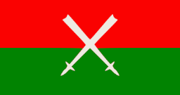
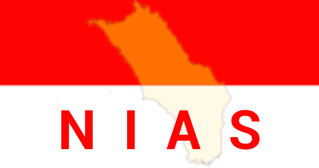

# Packs in this repository
1. &nbsp;Afrikaans_oss: [Source](afrikaans_oss) • [Play Store](https://play.google.com/store/apps/details?id=com.anysoftkeyboard.languagepack.afrikaans_oss) • [Beta Channel](https://play.google.com/apps/testing/com.anysoftkeyboard.languagepack.afrikaans_oss)
1. &nbsp;Arabic: [Source](arabic) • [Play Store](https://play.google.com/store/apps/details?id=com.anysoftkeyboard.languagepack.arabic) • [Beta Channel](https://play.google.com/apps/testing/com.anysoftkeyboard.languagepack.arabic)
1. &nbsp;Armenian2: [Source](armenian2) • [Play Store](https://play.google.com/store/apps/details?id=com.anysoftkeyboard.languagepack.armenian2) • [Beta Channel](https://play.google.com/apps/testing/com.anysoftkeyboard.languagepack.armenian2)
1. &nbsp;Basque: [Source](basque) • [Play Store](https://play.google.com/store/apps/details?id=com.anysoftkeyboard.languagepack.basque) • [Beta Channel](https://play.google.com/apps/testing/com.anysoftkeyboard.languagepack.basque)
1. &nbsp;Belarusian: [Source](belarusian) • [Play Store](https://play.google.com/store/apps/details?id=com.anysoftkeyboard.languagepack.belarusian) • [Beta Channel](https://play.google.com/apps/testing/com.anysoftkeyboard.languagepack.belarusian)
1. &nbsp;Brazilian: [Source](brazilian) • [Play Store](https://play.google.com/store/apps/details?id=com.anysoftkeyboard.languagepack.brazilian) • [Beta Channel](https://play.google.com/apps/testing/com.anysoftkeyboard.languagepack.brazilian)
1. &nbsp;Bulgarian: [Source](bulgarian) • [Play Store](https://play.google.com/store/apps/details?id=com.anysoftkeyboard.languagepack.bulgarian) • [Beta Channel](https://play.google.com/apps/testing/com.anysoftkeyboard.languagepack.bulgarian)
1. &nbsp;Catalan: [Source](catalan) • [Play Store](https://play.google.com/store/apps/details?id=com.anysoftkeyboard.languagepack.catalan) • [Beta Channel](https://play.google.com/apps/testing/com.anysoftkeyboard.languagepack.catalan)
1. &nbsp;Coptic: [Source](coptic) (not published reason: 'Pending application creation.')
1. &nbsp;Croatian: [Source](croatian) • [Play Store](https://play.google.com/store/apps/details?id=com.anysoftkeyboard.languagepack.croatian) • [Beta Channel](https://play.google.com/apps/testing/com.anysoftkeyboard.languagepack.croatian)
1. &nbsp;Czech: [Source](czech) • [Play Store](https://play.google.com/store/apps/details?id=org.herrlado.ask.languagepack.czech) • [Beta Channel](https://play.google.com/apps/testing/org.herrlado.ask.languagepack.czech)
1. &nbsp;Danish: [Source](danish) • [Play Store](https://play.google.com/store/apps/details?id=com.anysoftkeyboard.languagepack.danish) • [Beta Channel](https://play.google.com/apps/testing/com.anysoftkeyboard.languagepack.danish)
1. &nbsp;Dutch: [Source](dutch) (not published reason: 'Pending application creation.')
1. &nbsp;English: [Source](english) (not published reason: 'Part of the main AnySoftKeyboard app.')
1. &nbsp;Finnish: [Source](finnish) • [Play Store](https://play.google.com/store/apps/details?id=com.menny.anysoftkeyboard.finnish) • [Beta Channel](https://play.google.com/apps/testing/com.menny.anysoftkeyboard.finnish)
1. &nbsp;French: [Source](french) • [Play Store](https://play.google.com/store/apps/details?id=com.anysoftkeyboard.languagepack.french) • [Beta Channel](https://play.google.com/apps/testing/com.anysoftkeyboard.languagepack.french)
1. &nbsp;Georgian: [Source](georgian) • [Play Store](https://play.google.com/store/apps/details?id=com.anysoftkeyboard.languagepack.georgian) • [Beta Channel](https://play.google.com/apps/testing/com.anysoftkeyboard.languagepack.georgian)
1. &nbsp;German: [Source](german) • [Play Store](https://play.google.com/store/apps/details?id=com.anysoftkeyboard.languagepack.german) • [Beta Channel](https://play.google.com/apps/testing/com.anysoftkeyboard.languagepack.german)
1. &nbsp;Greek: [Source](greek) • [Play Store](https://play.google.com/store/apps/details?id=com.anysoftkeyboard.languagepack.greek) • [Beta Channel](https://play.google.com/apps/testing/com.anysoftkeyboard.languagepack.greek)
1. &nbsp;Hebrew: [Source](hebrew) • [Play Store](https://play.google.com/store/apps/details?id=com.anysoftkeyboard.languagepack.hebrew) • [Beta Channel](https://play.google.com/apps/testing/com.anysoftkeyboard.languagepack.hebrew)
1. &nbsp;Hindi: [Source](hindi) (not published reason: 'Pending application creation.')
1. &nbsp;Hungarian: [Source](hungarian) (not published reason: 'Pending application creation.')
1. &nbsp;Indonesian: [Source](indonesian) • [Play Store](https://play.google.com/store/apps/details?id=com.anysoftkeyboard.languagepack.indonesian) • [Beta Channel](https://play.google.com/apps/testing/com.anysoftkeyboard.languagepack.indonesian)
1. &nbsp;Italian: [Source](italian) • [Play Store](https://play.google.com/store/apps/details?id=com.anysoftkeyboard.languagepack.italian) • [Beta Channel](https://play.google.com/apps/testing/com.anysoftkeyboard.languagepack.italian)
1. &nbsp;Kachin: [Source](kachin) • [Play Store](https://play.google.com/store/apps/details?id=com.anysoftkeyboard.languagepack.kachin) • [Beta Channel](https://play.google.com/apps/testing/com.anysoftkeyboard.languagepack.kachin)
1. &nbsp;Kurdish: [Source](kurdish) • [Play Store](https://play.google.com/store/apps/details?id=com.anysoftkeyboard.languagepack.kurdish) • [Beta Channel](https://play.google.com/apps/testing/com.anysoftkeyboard.languagepack.kurdish)
1. &nbsp;Latvian: [Source](latvian) • [Play Store](https://play.google.com/store/apps/details?id=com.anysoftkeyboard.languagepack.latvian) • [Beta Channel](https://play.google.com/apps/testing/com.anysoftkeyboard.languagepack.latvian)
1. &nbsp;Lithuanian: [Source](lithuanian) • [Play Store](https://play.google.com/store/apps/details?id=org.herrlado.ask.languagepack.lithuanian) • [Beta Channel](https://play.google.com/apps/testing/org.herrlado.ask.languagepack.lithuanian)
1. &nbsp;Luxembourgish: [Source](luxembourgish) • [Play Store](https://play.google.com/store/apps/details?id=com.anysoftkeyboard.languagepack.luxembourgish) • [Beta Channel](https://play.google.com/apps/testing/com.anysoftkeyboard.languagepack.luxembourgish)
1. &nbsp;Nias: [Source](nias) (not published reason: 'Owned by an external [developer](https://play.google.com/store/apps/details?id=com.anysoftkeyboard.languagepack.nias).')
1. &nbsp;Norwegian: [Source](norwegian) • [Play Store](https://play.google.com/store/apps/details?id=com.anysoftkeyboard.languagepack.norwegian) • [Beta Channel](https://play.google.com/apps/testing/com.anysoftkeyboard.languagepack.norwegian)
1. &nbsp;Ossturkish: [Source](ossturkish) • [Play Store](https://play.google.com/store/apps/details?id=com.anysoftkeyboard.languagepack.ossturkish) • [Beta Channel](https://play.google.com/apps/testing/com.anysoftkeyboard.languagepack.ossturkish)
1. &nbsp;Persian: [Source](persian) • [Play Store](https://play.google.com/store/apps/details?id=com.anysoftkeyboard.languagepack.persian) • [Beta Channel](https://play.google.com/apps/testing/com.anysoftkeyboard.languagepack.persian)
1. &nbsp;Piedmontese: [Source](piedmontese) (not published reason: 'Initial publish was not done yet.')
1. &nbsp;Polish: [Source](polish) • [Play Store](https://play.google.com/store/apps/details?id=com.anysoftkeyboard.languagepack.osspolish) • [Beta Channel](https://play.google.com/apps/testing/com.anysoftkeyboard.languagepack.osspolish)
1. &nbsp;Portuguese: [Source](portuguese) (not published reason: 'Initial publish was not done yet.')
1. &nbsp;Romanian: [Source](romanian) • [Play Store](https://play.google.com/store/apps/details?id=com.anysoftkeyboard.languagepack.romanian) • [Beta Channel](https://play.google.com/apps/testing/com.anysoftkeyboard.languagepack.romanian)
1. &nbsp;Russian2: [Source](russian2) • [Play Store](https://play.google.com/store/apps/details?id=com.anysoftkeyboard.languagepack.russian2) • [Beta Channel](https://play.google.com/apps/testing/com.anysoftkeyboard.languagepack.russian2)
1. &nbsp;Rusyn: [Source](rusyn) (not published reason: 'owner unknown (may have not been published yet).')
1. &nbsp;Sardinian: [Source](sardinian) • [Play Store](https://play.google.com/store/apps/details?id=com.anysoftkeyboard.languagepack.sardinian) • [Beta Channel](https://play.google.com/apps/testing/com.anysoftkeyboard.languagepack.sardinian)
1. &nbsp;Serbian: [Source](serbian) (not published reason: 'owner unknown (may have not been published yet).')
1. &nbsp;Sinhala: [Source](sinhala) (not published reason: 'Pending app creation.')
1. &nbsp;Spain: [Source](spain) • [Play Store](https://play.google.com/store/apps/details?id=com.anysoftkeyboard.languagepack.spain) • [Beta Channel](https://play.google.com/apps/testing/com.anysoftkeyboard.languagepack.spain)
1. &nbsp;Tamazight: [Source](tamazight) • [Play Store](https://play.google.com/store/apps/details?id=com.anysoftkeyboard.languagepack.tamazight) • [Beta Channel](https://play.google.com/apps/testing/com.anysoftkeyboard.languagepack.tamazight)
1. &nbsp;Thai: [Source](thai) (not published reason: 'Pending app creation.')
